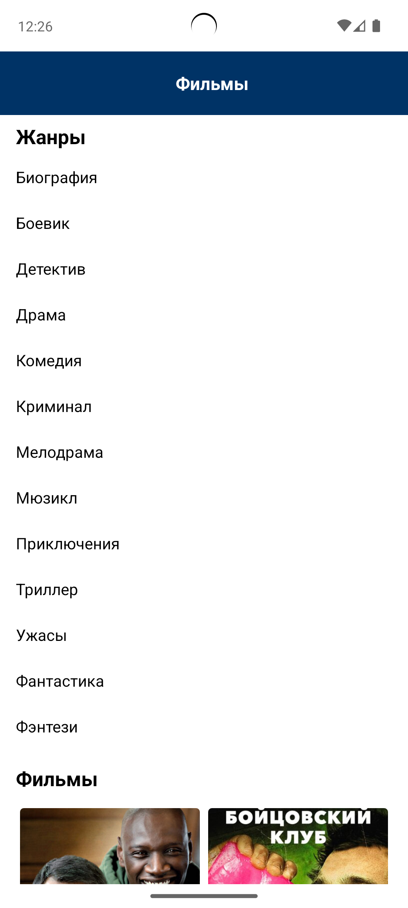

# Kinopoisk Android App

An Android application for browsing a list of movies with genre-based filtering and viewing detailed movie information. The project was built according to the provided technical specification and uses movie data from Kinopoisk.

## Technologies Used

- **Kotlin**
- **MVVM Architecture**
- **Retrofit** for networking
- **Koin** for dependency injection
- **Glide** for image loading
- **RecyclerView** for lists

## Screenshots

### Main Screen & Genre Filter
 

### Info Screen


## Getting Started

1. Clone the repository:
   ```bash
   git clone https://github.com/IPseudoNemoI/test-kinopoisk.git
2. Open the project in **Android Studio**.
3. Build and run the app on an emulator or physical device.

## API

This app uses [Kinopoisk](https://s3-eu-west-1.amazonaws.com/sequeniatesttask/films.json) as the data source.

## Additional Notes
- Implemented loading indicator during data fetching
- Implemented error handling with error message
- Implemented single-select genre filter
- Implemented display of the poster and the title of the film (maximum 2 lines with ellipsis)

## Download APK

You can download the working APK for testing:

➡️ [Download testkinopoisk-debug.apk](./release/testkinopoisk-debug.apk)

## Authors
Andrey Bashkov </br>
[@GitHub](https://github.com/IPseudoNemoI) </br>
[@Telegram](https://t.me/ipseudonemoi)
